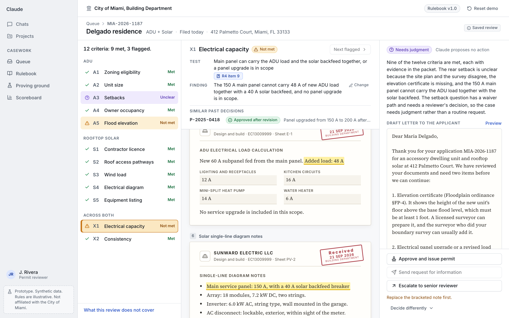
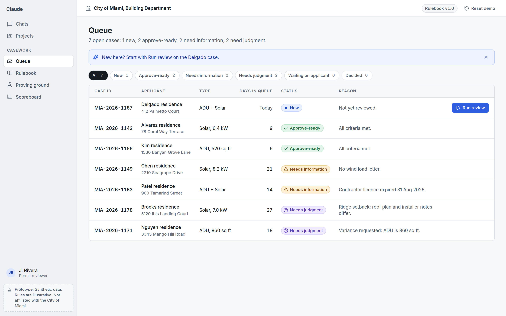
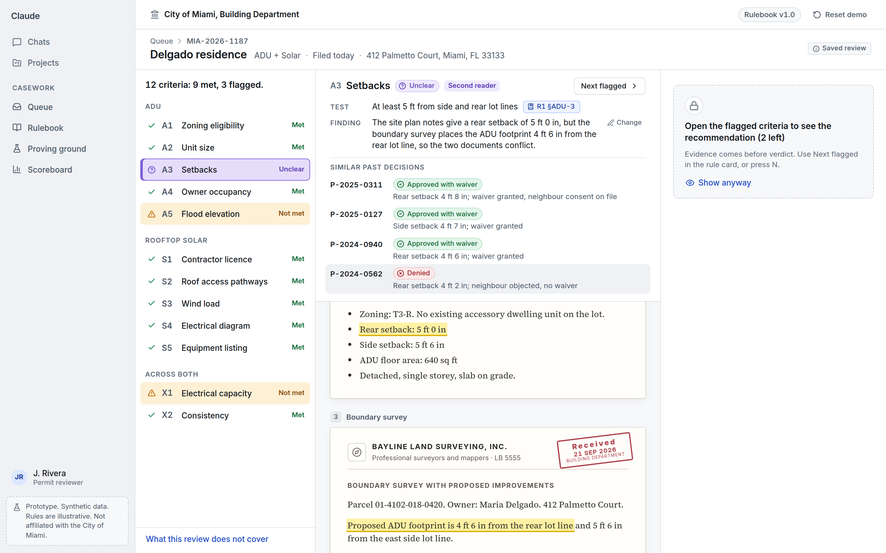
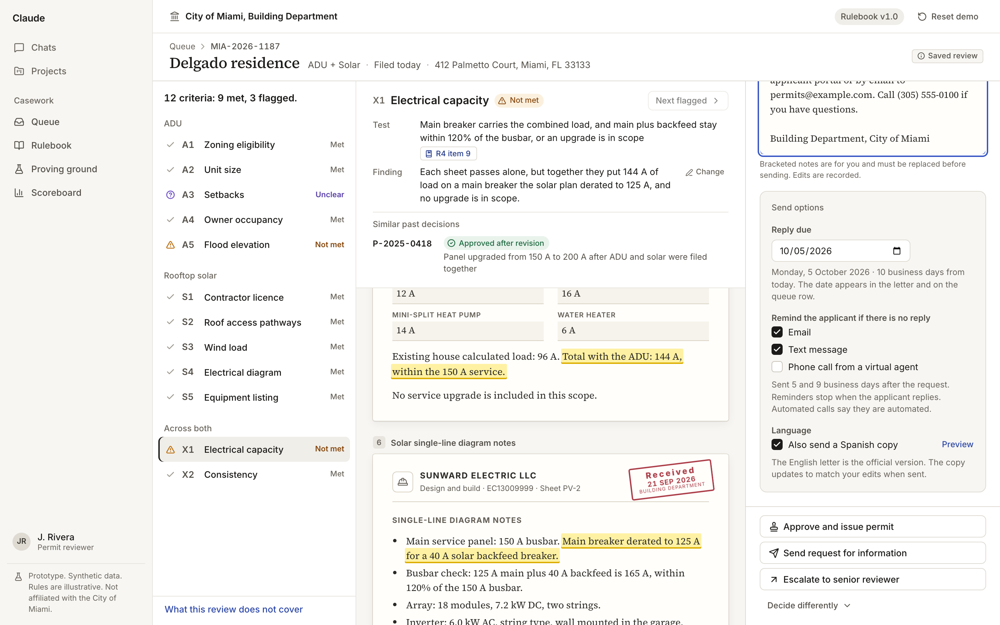
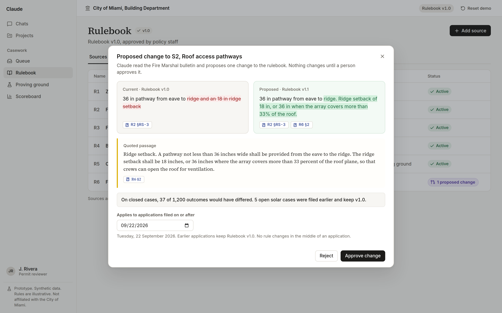
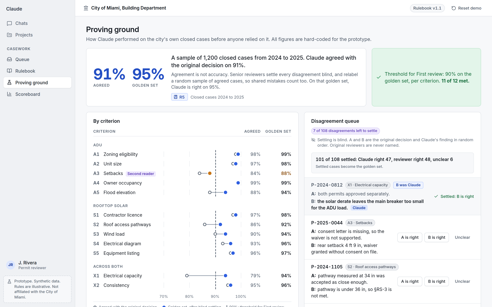
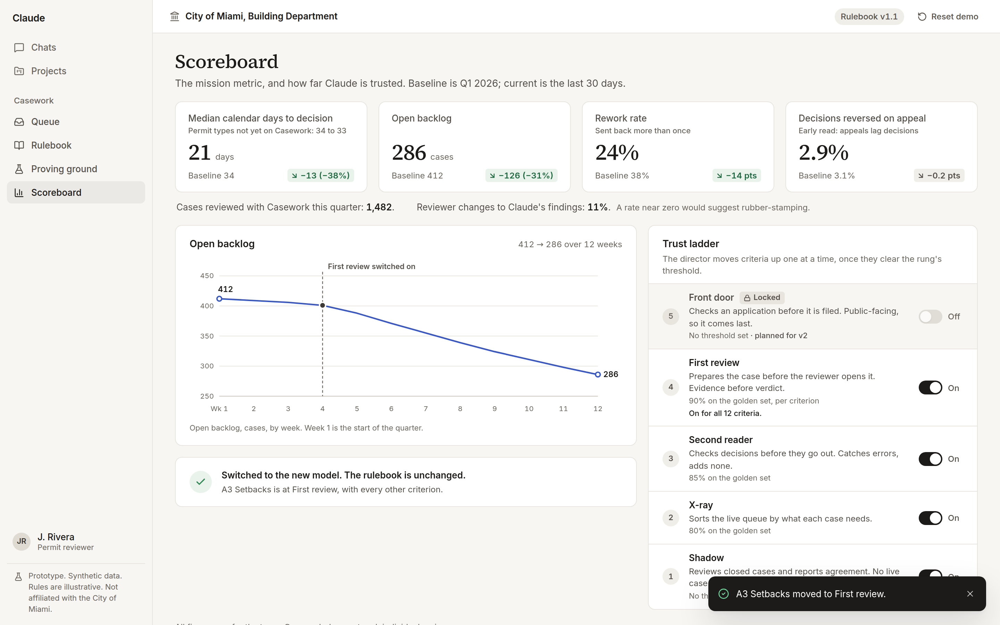

# Casework

Chat makes employees faster. Casework makes agencies faster.

Casework is a review layer inside Claude Enterprise and Claude for Government. It prepares every case against an agency's own rules, and it proves its accuracy on that agency's closed cases before anyone relies on it. This repository is the clickable prototype that accompanies the memo [*Casework: turning model capability into state capacity*](docs/MEMO.md).



**Synthetic data.** Every person, address, parcel, case, rule excerpt, and figure is invented. The City of Miami is used for illustration only and has no involvement. A tag saying so is on every screen.

## Try it

- **In one minute, no install.** Download `casework-demo.html` from the [latest release](https://github.com/andrewhuot/casework-prototype/releases/latest) (or from [`release/`](release/casework-demo.html) in this repo), open it in a browser window at least 1280 px wide, and click **Run review** on the Delgado case. It works offline.
- **Watch it.** [`docs/walkthrough.mp4`](docs/walkthrough.mp4) is a silent 4:26 recording, paced to [the demo script](docs/DEMO_SCRIPT.md).

## What the prototype has to prove

The memo makes five claims. A prototype earns its place by making each one concrete enough to argue with.

| The memo claims | Where you see it |
| --- | --- |
| Time to decision is wait, plus touch, plus rework, and chat only trims touch inside a case already open | The queue is sorted by how much judgment each case needs. One consolidated letter replaces three rounds. The applicant's clock pauses while she replies |
| Claude catches what separate reviewers miss, and shows its work | The Delgado case, X1: each electrical sheet passes alone, and together they fail. Every finding is one click from its evidence, its rule, and its precedents |
| Trust is earned per criterion, on the agency's own cases | Proving ground: 91% agreed, 95% on the golden set. Setbacks sits below the city's bar, so it stays at Second reader |
| A stronger model becomes a measured gain | Scoreboard: a new model is re-run on the golden set first, and setbacks moves up a rung when the director says so |
| Revenue can follow the mission | Scoreboard: calendar days to decision against a baseline and a comparison group, which is what a share of fees at risk would be measured on |

## Four surfaces, one for each person who can say no

| Surface | For | The question it answers |
| --- | --- | --- |
| Review (the Queue and Case review) | The reviewer | What do I open next, and what did Claude find? |
| Rulebook | The policy lead | Where do the rules come from, and what changes if I approve this? |
| Proving ground | The general counsel | How accurate is it on our own cases? |
| Scoreboard | The director | Is the mission metric moving, and how far do we trust it? |

## Design decisions worth arguing with

- **The reviewer never writes a prompt.** Opening a case shows the finished review. Prompting is a skill we should not require of every reviewer.
- **Evidence before verdict.** The recommendation stays hidden until every flagged criterion has been opened. It is the cheapest defense against rubber-stamping.
- **Claude can speed a yes, never automate a no.** It never proposes a denial. Only a person starts an adverse action.
- **Agreement is not accuracy.** A disagreement is not an error until someone settles it, blind, and an agreement is not proof, so senior reviewers also relabel a random sample of agreed cases. Electrical capacity has the lowest agreement and the largest gain once settled, 79% to 94%, because the original reviewers approved two permits separately.
- **A stronger model changes the scores, never the permissions.** Its new disagreements are settled blind first, and criteria move up one at a time, only when a person moves them.
- **Two clocks, on purpose.** The queue clock pauses while a request is out, so no reviewer is blamed for the applicant's time. The metric a fee would be paid on never pauses: it counts calendar days, as the applicant lives them, so more requests can never look like speed.
- **Rules never change mid-application.** Every change carries an effective date and a preview of its effect on past decisions.
- **Team-level metrics only, with the override rate beside them.** The tool measures the mission, not the person. An override rate near zero would be a warning, not a win.

## What is real and what is not

- **Real.** The seven saved reviews are Claude's output from the packet text, produced as described in [`docs/REVIEW_GENERATION.md`](docs/REVIEW_GENERATION.md). The tests hold that output to its packets: every quote is an exact substring, every ID exists, each recommendation follows the rules, and each electrical conclusion is re-derived from the packet's own numbers ([`src/lib/electrical.ts`](src/lib/electrical.ts)).
- **Illustrative.** Every figure on the Proving ground and the Scoreboard, every rule excerpt, and every name.
- **Not built.** Live model calls (`reviewCase(caseId)` in `src/data/reviews/index.ts` is the seam), integrations, sign-in, persistence, and the applicant-facing Front door.

## The four-minute demo

Click **Reset demo** first. The full script, with what to click and what to say, is in [`docs/DEMO_SCRIPT.md`](docs/DEMO_SCRIPT.md).

| Time | Beat | The point it lands |
| --- | --- | --- |
| 0:00 | Queue | Most of 34 days is waiting and rework, not reading |
| 0:20 | Run review on Delgado | The reviewer never writes a prompt |
| 0:35 | A3 Setbacks | Conflicts are marked unclear, not guessed. Setbacks is still at Second reader, so the call is the reviewer's |
| 1:10 | A5 Flood elevation | A missing document is caught in the first minute, not three weeks later |
| 1:20 | X1 Electrical capacity | Each sheet passes alone; together, 144 A of load sits on a 125 A breaker |
| 1:50 | Recommendation and send | Evidence before verdict. One letter, in Spanish, with reminders, on the record |
| 2:35 | Rulebook | A new bulletin becomes a proposed change, with its effect on 37 past decisions |
| 3:10 | Proving ground | Agreement is not accuracy: electrical capacity is 79% agreed, 94% on the golden set |
| 3:45 | Scoreboard | 34 to 21 days against a comparison group. A new model lifts setbacks over the bar, and the director moves it up |
| 4:20 | Close | "Casework: from seats to cases." |

## Run it from source

You need Node.js 20 or newer.

```bash
git clone https://github.com/andrewhuot/casework-prototype.git
cd casework-prototype
npm install
npm run dev            # http://localhost:5173
```

```bash
npm run build:single   # one self-contained file: release/casework-demo.html
npm test               # data checks, electrical rules, dates (87 tests)
npm run test:e2e       # the demo script beat by beat, axe on every screen, offline build (19 tests)
npm run check:names    # naming rule
```

The demo date is fixed at 21 Sep 2026, and state lives in memory only. **Reset demo** restores the start.

## How it was built

With Claude Code, from a written spec ([`docs/REQUIREMENTS.md`](docs/REQUIREMENTS.md)) and an acceptance checklist ([`docs/ACCEPTANCE.md`](docs/ACCEPTANCE.md)), the way a prototype would be built at work. The tests exist to hold the prototype to the spec, not to make it production-shaped. [`docs/PLAN.md`](docs/PLAN.md) records every choice the spec left open and how it was resolved, and [`CLAUDE.md`](CLAUDE.md) holds the project rules the agent works under.

## Screenshots

Captured by the walkthrough test at 1440 by 900.

| | |
| --- | --- |
|  |  |
|  |  |
|  |  |
