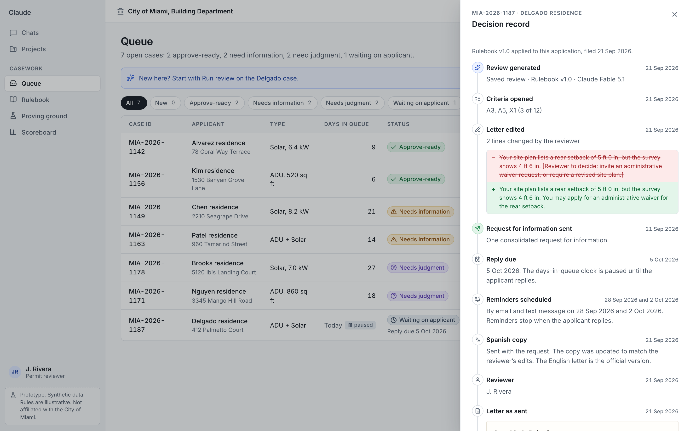
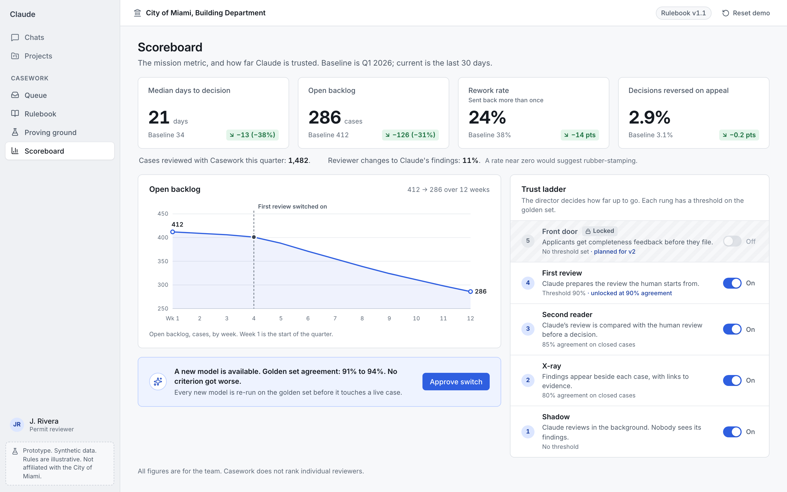

# Casework

Casework is a high-fidelity, front-end-only prototype of AI-assisted permit review for a city building department. A reviewer opens a combined ADU and rooftop solar application that Claude has already checked against the city's own rulebook; every finding links to its evidence, its rule, and similar past decisions, and the reviewer decides. Three supporting screens show where the rules come from (Rulebook), how trust is earned (Proving ground), and how the mission metric moves (Scoreboard). Nothing leaves the browser: the seven reviews were generated ahead of time by Claude from the packet text and saved with their cases, and `reviewCase(caseId)` is the seam where a live call would go.

**Synthetic data.** Every person, address, parcel, case, rule text, and section number is invented. The City of Miami is used for illustration only and has no involvement. Source names point to real bodies of rules, but their content here is illustrative. Emails end in `example.com` and phone numbers use 555. A tag saying so is visible on every screen.

## Run it

```bash
npm install
npm run dev
```

Then open http://localhost:5173. The demo date is fixed at 21 Sep 2026, and **Reset demo** in the top bar restores the starting state. State lives in memory only.

## Build it

```bash
npm run build          # static build in dist/
npm run build:single   # one self-contained file: release/casework-demo.html
```

The single-file build inlines the fonts and icons. Double-click `release/casework-demo.html` to open it from disk; it works offline with no network requests.

## Check it

```bash
npm test               # section 9 data checks and date maths (Vitest)
npm run test:e2e       # the demo script beat by beat, axe on every screen, offline build (Playwright)
npm run check:names    # naming rule
```

## Demo

The five-minute script is in [docs/DEMO_SCRIPT.md](docs/DEMO_SCRIPT.md). The build plan and the decisions made where the spec left a choice are in [docs/PLAN.md](docs/PLAN.md); the acceptance checklist is in [docs/ACCEPTANCE.md](docs/ACCEPTANCE.md); how the saved reviews were produced is in [docs/REVIEW_GENERATION.md](docs/REVIEW_GENERATION.md).

## Screenshots

Captured by the walkthrough test at 1440 by 900, 2x.

| | |
| --- | --- |
|  |  |
|  |  |
|  |  |
|  |  |
