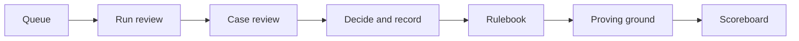

# Casework prototype: requirements

2026-09-20 · @Someone

## 1. Purpose and scope

The deliverable is a five-minute, end-to-end demo, and section 11 is its script. Every requirement in this document exists to make that script run without a dead end.

The demo shows a City of Miami reviewer clearing a combined ADU and rooftop solar application in minutes. Claude has already checked it against the city's own rules, and every finding links to its evidence, its rule, and similar past decisions. Three supporting screens show where the rules come from (Rulebook), how trust is earned (Proving ground), and how the mission metric moves (Scoreboard).

**In scope**

- Front-end only: a static app with no backend and no saved state. The brief asks for exactly this: no cloud infrastructure, no configured services, nothing production-shaped. Nothing leaves the browser at runtime. Claude generates each review ahead of time, and it is saved with its case.
- Four navigation items: Queue, Rulebook, Proving ground, Scoreboard. Case review opens from the Queue.
- Seven synthetic cases, each with a saved review packet.
- Simulated uploads: adding a source never parses or sends a file.

**Out of scope**

- Sign-in, roles, real file parsing, integrations, persistence, applicant-facing views, mobile layout.

**UX rules**

- The reviewer never writes a prompt. Opening a case shows the finished review.
- One primary action per screen, and the same patterns everywhere (section 3).
- Every finding is one click from its evidence, its rule, and its precedents.
- Evidence comes before verdict, and Claude never proposes denial.
- Status always carries an icon and a text label, never colour alone.

**Build path and your time**

Claude Code builds the prototype from this document and the handoff prompt, so the brief's 3 to 4 hours goes to your own work.

| Your time | Minutes |
| --- | --- |
| Review the build against section 10 and ask for fixes | 45 |
| Rehearse the section 11 script twice, then record | 45 |
| Write the memo | 120 |

- The brief says rough is fine. High fidelity is a choice here because the build costs agent time, not yours. Say so in one line of the memo or the recording.
- Keep it prototype-shaped: no services, no deployment pipeline, no accounts.
- The memo is the main deliverable, and nothing in this document writes it.

## 2. Scenario and synthetic data

The customer is the City of Miami Building Department, and the hero case is one homeowner filing an ADU and rooftop solar together. All people, addresses, cases, rule text, and section numbers are invented. Source names point to real bodies of rules, but their content here is illustrative only. All data is hard-coded.

**Hero case: MIA-2026-1187, Delgado residence**

- Maria Delgado, 412 Palmetto Court (fictional), files one combined application. It covers a 640 sq ft detached ADU in the rear yard and a 7.2 kW rooftop solar array on the main house.
- The packet is seven plain-text documents, under 450 words in total. Write each quoted phrase below literally so it can be highlighted.

| Document | Must contain |
| --- | --- |
| Combined application form | Owner, parcel 01-4102-018-0420, scope of both projects, signature. Preferred language: Spanish. Contact: a synthetic email address and mobile number. Contractor: Sunward Electric LLC, licence EC13009999, expires 31 Aug 2027 |
| ADU site plan notes | "Rear setback: 5 ft 0 in", "Side setback: 5 ft 6 in", "ADU floor area: 640 sq ft" |
| Boundary survey | "Proposed ADU footprint is 4 ft 6 in from the rear lot line" |
| ADU electrical load calculation | "New 60 A subpanel fed from the main panel. Added load: 48 A" |
| Solar single-line diagram notes | "Main service panel: 150 A, with a 40 A solar backfeed breaker", inverter and disconnect shown |
| Solar equipment and structural | Module and inverter spec sheets stating UL listing. Signed and sealed wind load letter for the High-Velocity Hurricane Zone. Roof plan with a 36 in pathway and an 18 in ridge setback |
| Owner-occupancy affidavit | Notarised |

- The elevation certificate is absent on purpose.
- Expected review: nine criteria met and three flagged. A3 is unclear (5 ft 0 in against 4 ft 6 in). A5 is not met (no elevation certificate). X1 is not met (a 150 A panel cannot carry 48 A of new load plus a 40 A backfeed, and no upgrade is in scope).
- Expected recommendation: Needs judgment. The draft letter requests the elevation certificate and a panel upgrade or revised load calculation.
- The letter also holds one bracketed line for the reviewer: "\[Reviewer to decide: invite an administrative waiver request, or require a revised site plan.\]" A saved Spanish version of the letter is stored with the case.

**Rulebook v1.0: twelve criteria in three groups**

| ID | Group | Short name | Test | Source |
| --- | --- | --- | --- | --- |
| A1 | ADU | Zoning eligibility | Lot is in a zone that allows one ADU, and none exists on the lot | R1 §ADU-1 |
| A2 | ADU | Unit size | Floor area is 800 sq ft or less | R1 §ADU-2 |
| A3 | ADU | Setbacks | At least 5 ft from side and rear lot lines | R1 §ADU-3 |
| A4 | ADU | Owner occupancy | Notarised owner-occupancy affidavit is included | R1 §ADU-5 |
| A5 | ADU | Flood elevation | Elevation certificate shows the finished floor at least 1 ft above base flood elevation | R3 §FP-4 |
| S1 | Rooftop solar | Contractor licence | Florida licence number is given and the expiry date is in the future | R4 item 2 |
| S2 | Rooftop solar | Roof access pathways | 36 in pathway from eave to ridge and an 18 in ridge setback | R2 §RS-3 |
| S3 | Rooftop solar | Wind load | Signed and sealed engineer's letter covers attachment in the High-Velocity Hurricane Zone | R2 §RS-5 |
| S4 | Rooftop solar | Electrical diagram | Single-line diagram shows inverter, disconnect, and main panel rating | R2 §RS-6 |
| S5 | Rooftop solar | Equipment listing | Spec sheets for modules and inverter each state a UL listing | R2 §RS-7 |
| X1 | Across both | Electrical capacity | Main panel can carry the ADU load and the solar backfeed together, or a panel upgrade is in scope | R4 item 9 |
| X2 | Across both | Consistency | Owner, parcel number, and address match across all documents | R4 item 1 |

**Sources: the reference library**

| ID | Name | Type | Used for |
| --- | --- | --- | --- |
| R1 | Zoning code: accessory dwelling units (excerpt) | Regulation | A1 to A4 |
| R2 | Florida Building Code: rooftop solar (excerpt) | Regulation | S2 to S5 |
| R3 | Floodplain ordinance (excerpt) | Regulation | A5 |
| R4 | Building Department plan review checklist, 2026 | Internal manual | S1, X1, X2 |
| R5 | Closed cases 2024 to 2025 (1,200 decisions) | Prior decisions | Precedents and Proving ground |
| R6 | Fire Marshal bulletin 2026-03: rooftop access pathways | Regulation | Added during the demo; proposes a change to S2 |

- R1 to R4 and R6 each store a synthetic excerpt of 100 to 200 words, using the section labels above. R6 is not in the library on load.

**Prior decisions: eight, drawn from R5**

| ID | Criterion | Outcome | Summary |
| --- | --- | --- | --- |
| P-2025-0311 | A3 | Approved with waiver | Rear setback 4 ft 8 in; waiver granted, neighbour consent on file |
| P-2025-0127 | A3 | Approved with waiver | Side setback 4 ft 7 in; waiver granted |
| P-2024-0940 | A3 | Approved with waiver | Rear setback 4 ft 6 in; waiver granted |
| P-2024-0562 | A3 | Denied | Rear setback 4 ft 2 in; neighbour objected, no waiver |
| P-2025-0418 | X1 | Approved after revision | Panel upgraded from 150 A to 200 A after ADU and solar were filed together |
| P-2024-0733 | A5 | Approved after revision | Elevation certificate supplied on resubmission |
| P-2025-0209 | A2 | Denied | ADU of 910 sq ft; variance refused |
| P-2025-0366 | S2 | Approved after revision | Ridge setback corrected from 14 in to 18 in |

**Queue cases**

| Case ID | Applicant | Type | Days in queue | Planted issue | Status on load |
| --- | --- | --- | --- | --- | --- |
| MIA-2026-1187 | Delgado residence | ADU + Solar | 0 | See hero case | New |
| MIA-2026-1142 | Alvarez residence | Solar, 6.4 kW | 9 | None | Approve-ready |
| MIA-2026-1156 | Kim residence | ADU, 520 sq ft | 6 | None | Approve-ready |
| MIA-2026-1149 | Chen residence | Solar, 8.2 kW | 21 | No wind load letter (S3) | Needs information |
| MIA-2026-1163 | Patel residence | ADU + Solar | 14 | Contractor licence expired 31 Aug 2026 (S1). One request for information was already sent | Needs information |
| MIA-2026-1171 | Nguyen residence | ADU, 860 sq ft | 18 | Over 800 sq ft, variance requested (A2) | Needs judgment |
| MIA-2026-1178 | Brooks residence | Solar, 7.0 kW | 27 | Roof plan says 18 in ridge setback, installer notes say 14 in (S2) | Needs judgment |

- The builder writes a packet of under 250 words and a saved review for each of the six other cases, following the planted issue.
- Criteria that do not apply to a permit type are left out of that case's review. X2 applies to every case, and X1 only to combined cases.

**Recommendation logic**

- Approve-ready: every applicable criterion is met.
- Needs judgment: any criterion is unclear, or the packet asks for a variance or waiver.
- Needs information: everything else.
- Claude never recommends denial. Only a human can start an adverse action.

## 3. App shell and shared UX patterns

The app is a static front end, and it reuses a small set of patterns so every screen behaves the same way.

**Technical**

- A static front-end project that also builds to one self-contained HTML file. No requests leave the browser at runtime.
- State lives in memory. A "Reset demo" link in the top bar restores the starting state.
- No browser storage, no external images, no analytics.
- Reviews load through one function, `reviewCase(caseId)`, so a live model call can replace the saved reviews later.
- The demo date is fixed at 21 Sep 2026, so dates, tests, and screenshots never drift.
- Desktop layout from 1280 px wide. It should not break on a tablet, and phones are out of scope.

**Shell**

- Left navigation, 220 px wide. Two muted, inactive items, Chats and Projects, sit at the top to signal that Casework lives inside the existing product.
- Below them is a Casework group in this order: Queue (default), Rulebook, Proving ground, Scoreboard.
- The top bar shows "City of Miami, Building Department", the current rulebook version ("Rulebook v1.0"), and "Reset demo".
- A persistent tag reads: "Prototype. Synthetic data. Rules are illustrative. Not affiliated with the City of Miami."
- The company name and logo appear nowhere: not in the interface, page title, file name, code comments, or prompt text. The product is called Casework.

**Shared patterns**

- One right-side drawer, 480 px wide, serves four uses: Source viewer, Past decision, Decision record, and Letter preview. It closes with its X button or the Escape key.
- A source chip looks the same everywhere, for example "R1 §ADU-3". Clicking it opens the Source viewer with that passage highlighted.
- Case status chips: New (blue, dot icon), Approve-ready (green, check), Needs information (amber, alert), Needs judgment (violet, question), Waiting on applicant (slate, clock), Decided (grey).
- Criterion statuses: Met (green, check), Not met (amber, alert), Unclear (violet, question).
- The rulebook version is one global value. It appears in the top bar, the review progress, and each decision record.
- Confirmations are short toasts at the bottom right. An empty filter shows "No cases match this filter."
- Anything sent outside the department can be undone for ten seconds from its toast.
- Dates read plainly, for example "5 Oct 2026", and due dates count business days.
- Accessibility basics: every control works from the keyboard, focus is visible, inputs have labels, and text meets AA contrast.

**Look**

- White and grey surfaces, one accent colour, a system font, generous spacing, and no decoration.

## 4. Screen 1: Queue

The queue tells the reviewer what to open next. Cases arrive already sorted by how much human judgment they need.

- A dismissible hint sits at the top on first load: "New here? Start with Run review on the Delgado case."
- A summary line sits above the table: "7 open cases: 1 new, 2 approve-ready, 2 need information, 2 need judgment." It updates as cases change.
- One table with columns: Case ID, Applicant, Type, Days in queue, Status, Reason.
- Reason is one line from the review, for example "No wind load letter." A New case shows "Not yet reviewed."
- Default sort: New first, then Approve-ready, Needs information, Needs judgment, Waiting on applicant, Decided. Within a status, oldest first.
- Filter chips above the table: All, New, Approve-ready, Needs information, Needs judgment, Waiting on applicant, Decided.
- A New row carries a "Run review" button. Progress shows as three steps that tick off in turn: "Reading 7 documents", "Checking 12 criteria against Rulebook v1.0", "Finding similar past decisions". Case review then opens.
- In a real deployment the review would run on arrival. The button exists so the demo can show the review happening.
- The steps tick over about three seconds, slowly enough to read, and then the saved review loads (section 9).
- Clicking any other row opens Case review with its saved review.
- After a request for information is sent, the row reads "Waiting on applicant" with its due date, "Reply due 5 Oct 2026". Its days-in-queue clock stops and is labelled "paused", so applicant time never counts against the city.
- A Decided row shows its outcome under the chip, for example "Permit issued". Waiting and Decided rows both carry a "Decision record" link that opens the drawer.
- Pasting in a new application is out of scope, because it would need a live model call.

## 5. Screen 2: Case review

This screen carries the demo, so spend most of the build time here. It reads left to right in the order a reviewer thinks: what was checked, what the evidence says, what to do.

A header shows a breadcrumb ("Queue / MIA-2026-1187"), the applicant, the type, days in queue, and a "Saved review" tag. Its tooltip reads: "Generated by Claude from these documents, then saved so the demo is repeatable."

**Left pane: criteria (about 24% width)**

- A count at the top: "12 criteria: 9 met, 3 flagged."
- Criteria stay in rulebook order under three group headings: ADU, Rooftop solar, Across both. A group with no applicable criteria is hidden.
- Each row shows a status icon, the ID, the short name, and the label Met, Not met, or Unclear. Flagged rows have a tinted background.
- The first flagged row is selected on open. If none are flagged, the first row is selected.
- A "What this review does not cover" link at the foot of the pane opens a short note: structural plan review, historic district review, and tree removal permits.

**Centre pane: evidence (about 46% width)**

- A rule card at the top shows, in order: the criterion's test, its source chip, Claude's one-sentence finding, and "Similar past decisions".
- Similar past decisions lists up to four rows: ID, outcome chip, one-line summary. A row opens the Past decision drawer. With no precedents, the block is hidden.
- A "Next flagged" button sits at the right of the rule card. It selects the next flagged criterion and is disabled after the last one.
- Below the card, the case documents are stacked, each under its own heading. An expected document that is missing shows "Not provided".
- Up to two evidence quotes are highlighted for the selected criterion, and the first scrolls into view. Match quotes by exact string search.
- If a quote is not found, list it in the rule card as "Quoted evidence" with no highlight.

**Right pane: recommendation (about 30% width)**

- Evidence comes before verdict. While any flagged criterion is unopened, the pane shows "Open the flagged criteria to see the recommendation (2 left)" and a "Show anyway" link. The criterion selected on open counts as opened.
- Once revealed, it shows the status chip, a rationale of two or three sentences, and the draft letter in an editable text area.
- Bracketed text in the letter is highlighted. While it remains, "Send request for information" is disabled with the hint "Replace the bracketed note first."
- For Approve-ready and Needs information, the primary button matches the recommendation. For Needs judgment, Claude proposes no action and all three buttons carry equal weight.
- The buttons are: "Approve and issue permit", "Send request for information", and "Escalate to senior reviewer".
- Approving while any criterion is not met or unclear asks first: "2 criteria are not met and 1 is unclear. Approve anyway?" It requires a typed reason, which goes in the decision record.
- Approve swaps the letter for a standard approval notice filled in with the case details. Escalate asks for a short internal note and sends nothing to the applicant.
- A "Decide differently" menu holds the remaining actions plus "Deny". Deny requires a typed reason, and Claude never proposes it.

**Send options: shown under the letter whenever the draft is a request for information**

- "Reply due" is a date field, set by default to 10 business days from the demo date, which is 5 Oct 2026. The date also appears in the letter and on the queue row.
- "Remind the applicant if there is no reply" has three checkboxes. Email and Text message are ticked, and "Phone call from a virtual agent" is not.
- Helper text under the reminders: "Sent 5 and 9 business days after the request. Reminders stop when the applicant replies. Automated calls say they are automated."
- "Also send a Spanish copy" is ticked by default when the application states a preferred language. A "Preview" link opens the saved Spanish letter in the drawer.
- Helper text under the copy: "The English letter is the official version. The copy updates to match your edits when sent."
- Nothing is actually sent. The choices are stored on the case and listed in its decision record.

**After a decision**

- Approve, escalate, or deny: show a toast, set the case to Decided with its outcome, and return to the queue.
- Request for information: the toast reads "Request sent to Maria Delgado. Undo" for ten seconds. The case moves to Waiting on applicant, and Undo restores it.
- The Decision record drawer is a timeline: review generated (saved review, rulebook version, model), criteria opened, letter edited, action taken, reply due date, reminders scheduled for 28 Sep and 2 Oct 2026, Spanish copy, reviewer ("J. Rivera"), and the letter as sent.

**Only if time allows**

- A "Change" control under the finding with Met, Not met, and Unclear. A change asks for a reason and tags the row "Changed by reviewer".
- An "Ask about this case" block under the documents, with three suggested questions per case. Each shows a saved answer of up to three sentences with one quote. A note says free-form questions need a live model connection.
- Keyboard shortcuts: Up and Down move between criteria, and N selects the next flagged one.
- A request-round warning above the send options when a request was already sent: "This will be request 2 for this applicant. Check that it is complete." It appears on the Patel case.
- Choosing Deny shows: "This starts an adverse action. The letter will explain how to appeal."

## 6. Screen 3: Rulebook and sources

This screen answers "where do the rules come from?" The city adds its own documents as sources, Claude proposes criteria from them, and a person approves every change.

The screen has two tabs, Sources (default) and Criteria. Its heading shows the current version: "Rulebook v1.0, approved by policy staff".

**Sources tab**

- One table with columns: Name, Type, Added, Used for, Status. It lists R1 to R5 from section 2, all Active.
- Type is one of three tags: Regulation, Internal manual, Prior decisions.
- Used for shows the linked criteria as chips, for example A1 to A4. R5 shows "Precedents and Proving ground".
- Clicking a row opens the Source viewer drawer: the excerpt with its section labels, and the criteria that cite it.
- For R5, the drawer lists the eight prior decisions with their outcome chips instead.

**Add source**

- The primary button "Add source" opens a dialog with three fields: a choice of "Upload file" or "Paste link", a Name, and a Type.
- A "Load example" link fills in R6, the Fire Marshal bulletin, as a Regulation with a link.
- Nothing is parsed or sent. "Add" closes the dialog and adds a row with the status "Processing" for two seconds.
- R6 then changes to "1 proposed change". Any other source changes to Active with a toast: "Added as reference. No rule changes proposed."

**Proposed change**

- Clicking "1 proposed change" opens a panel with the current S2 test on the left and the proposed test on the right, with the difference marked.
- Proposed S2: "36 in pathway from eave to ridge. Ridge setback of 18 in, or 36 in when the array covers more than 33% of the roof."
- Under both sits the quoted passage from R6 with its source chip, "R6 §2".
- An impact line sits above the buttons: "On closed cases, 37 of 1,200 outcomes would have differed. 5 open solar cases were filed earlier and keep v1.0."
- "Applies to applications filed on or after" is a date field, set to the next business day, 22 Sep 2026. Helper text: "Earlier applications keep Rulebook v1.0. No rule changes in the middle of an application."
- Two buttons: "Approve change" (primary) and "Reject".
- Approve updates S2, links S2 to R6 as well as R2, sets R6 to Active, and raises the version to v1.1 everywhere.
- A toast confirms: "Rulebook v1.1 published by J. Okafor. It applies to applications filed from 22 Sep 2026." No re-check actually runs.

**Criteria tab**

- A read-only table of the twelve criteria, grouped as in section 2: ID, Short name, Test, Source chip.
- A criterion changed in this session carries an "Updated in v1.1" tag.

## 7. Screen 4: Proving ground

This screen shows how accurate Claude was on the city's own closed cases before anyone relied on it. All numbers are hard-coded.

- Headline: "1,200 closed cases from 2024 to 2025. Claude agreed with the original decision on 91%." A source chip for R5 sits beside it.
- Readiness banner: "Threshold for first review: 90%. Met."
- One horizontal bar per criterion, grouped as in section 2, showing agreement: A1 98%, A2 97%, A3 84%, A4 99%, A5 88%, S1 97%, S2 86%, S3 90%, S4 93%, S5 96%, X1 79%, X2 95%.
- One line under the bars: "Most disagreement sits in setbacks, roof pathways, and electrical capacity across permits."
- Disagreement queue: "108 cases to settle". Show five rows with Case ID, criterion, "Decision A", "Decision B", and a one-line reason for each. Two of the five are X1 rows.
- Settling is blind. A and B are the original decision and Claude's finding in random order, and original reviewers are never named.
- The first X1 row reads: "A: both permits approved separately. B: combined load exceeds the 150 A panel."
- Each row has three buttons: "A is right", "B is right", "Unclear". A click reveals which side was Claude, greys the row, and updates the tally.
- The tally starts at "40 of 108 settled: Claude right 19, reviewer right 17, unclear 4" and ends with "Settled cases become the golden set."

## 8. Screen 5: Scoreboard

This screen shows the mission metric moving, and it is where the director controls how far Claude is trusted. All numbers are hard-coded.

**Four metric tiles, each showing baseline, current, and change**

| Metric | Baseline (Q1 2026) | Last 30 days |
| --- | --- | --- |
| Median days to decision | 34 | 21 |
| Open backlog (cases) | 412 | 286 |
| Rework rate (sent back more than once) | 38% | 24% |
| Decisions reversed on appeal | 3.1% | 2.9% |

- One line under the tiles reads: "Cases reviewed with Casework this quarter: 1,482." It is the usage measure that per-case pricing would follow.
- A second line reads: "Reviewer changes to Claude's findings: 11%." Its helper text says: "A rate near zero would suggest rubber-stamping."
- A footnote on the screen reads: "All figures are for the team. Casework does not rank individual reviewers."

**Backlog chart**

- One line chart of open backlog over 12 weeks, falling from 412 to 286, with a marker at week 4 labelled "First review switched on".

**Trust ladder**

- Five rungs in a vertical list, each with a one-line description, its threshold, and a state.
- Shadow: on. X-ray: on. Second reader: on. First review: on, "unlocked at 90% agreement". Front door: locked, "planned for v2".
- Each unlocked rung has an on/off switch that only changes its label. The locked rung's switch is disabled.

**Model update card**

- Text: "A new model is available. Golden set agreement: 91% to 94%. No criterion got worse."
- An "Approve switch" button changes the card to "Switched to the new model. The rulebook is unchanged."

## 9. Review generation and data contract

Every review is generated ahead of time by Claude and saved as JSON with its case. Nothing calls a model at runtime, so the demo is repeatable and needs no key and no service.

**Review shape**

```json
{
  "criteria": [
    {
      "id": "X1",
      "status": "met | not_met | unclear",
      "finding": "One sentence, plain language.",
      "evidence": [
        { "document": "Solar single-line diagram notes", "quote": "Exact substring of the packet" }
      ],
      "precedents": ["P-2025-0418"]
    }
  ],
  "recommendation": "approve_ready | needs_information | needs_judgment",
  "reason": "One line for the queue, under 12 words.",
  "rationale": "Two or three sentences.",
  "letter": "Draft letter to the applicant, under 220 words."
}
```

**How the saved reviews are produced**

The builder runs each packet through Claude with the instructions below, and saves the output. It edits the output only where a check further down fails.

- Role: a permit review assistant for the City of Miami Building Department who prepares a review for a human reviewer and never decides.
- Input: the twelve criteria and the eight prior decisions from section 2 as JSON, then the packet text, the demo date, and the reply due date.
- First decide which groups apply from the scope of work. Return every applicable criterion, in rulebook order, with exactly one status.
- Copy evidence quotes character for character, 25 words at most and two per criterion at most. Use an empty list when the evidence is an absence.
- When two documents conflict, mark the criterion unclear and quote both. Do not guess.
- For X1, compare the ADU load and the solar backfeed against the main panel rating, and quote the load line and the panel line.
- List only prior decisions that share the criterion and resemble the facts. Never invent an ID.
- Apply the recommendation logic from section 2. Never recommend denial.
- The letter is polite, specific, and in plain language at about an eighth-grade reading level. It numbers the requested items, and for each one says what it is, why it is needed, and who can provide it.
- The letter names each missing item with its source label, ends with how to reply and the reply due date, and is signed "Building Department, City of Miami".
- Where the outcome needs human judgment, the letter holds one bracketed line that starts "\[Reviewer to decide:".

**Checks at build time**

- Every evidence quote is an exact substring of the document it names. A test enforces this.
- Every criterion ID and precedent ID exists in the data, and every applicable criterion appears exactly once.
- Each recommendation follows the logic in section 2, and each case matches its expected result there.
- The Delgado letter holds exactly one bracketed line, and its saved Spanish version says the same thing as the English.

**Later, not now**

- `reviewCase(caseId)` is the seam where a live model call would go. A live call needs a key or a proxy, which the brief rules out, so it stays out of this build.

## 10. Acceptance checklist

The build is done when the script in section 11 runs start to finish, and every click outside the script still lands somewhere sensible.

**Must work**

- [ ] The section 11 script runs start to finish inside five minutes, with no dead end
- [ ] Navigation between Queue, Rulebook, Proving ground, and Scoreboard, with no sign-in and no setup
- [ ] Queue sorting, filter chips, the first-visit hint, and the summary line updating after each change
- [ ] "Run review" on the Delgado case: three readable progress steps, then the saved review with its "Saved review" tag and tooltip
- [ ] All seven cases open with grouped criteria and the expected statuses
- [ ] Selecting a criterion shows its rule, source chip, finding, precedents, and highlighted evidence
- [ ] A3 on the Delgado case highlights both "5 ft 0 in" and "4 ft 6 in", and lists four past decisions
- [ ] "Next flagged" steps through A3, A5, and X1, and then the recommendation reveals
- [ ] The letter is editable, bracketed text disables sending with a hint, and the buttons follow the recommendation rules
- [ ] Approving with unmet or unclear criteria asks for confirmation and a reason
- [ ] Send options: reply due 5 Oct 2026, reminder checkboxes with their defaults, and the Spanish copy pre-ticked with a working preview
- [ ] Sending shows the Undo toast, moves the case to Waiting on applicant, and pauses its clock
- [ ] Deny exists only under "Decide differently" and requires a typed reason
- [ ] Waiting and Decided cases open a Decision record that lists the send options chosen
- [ ] Source viewer, Past decision, Decision record, and Letter preview all use the same drawer
- [ ] Add source with "Load example", the proposed S2 change with its impact line and effective date, approval, and v1.1 shown everywhere
- [ ] Proving ground settles disagreements blind and reveals Claude's side after the click
- [ ] Scoreboard renders the numbers given here, the override-rate line, and the team-level footnote
- [ ] "What this review does not cover" opens its note
- [ ] "Reset demo" restores the starting state
- [ ] The section 9 build-time checks pass
- [ ] The single-file build opens from disk, offline, with fonts and icons intact
- [ ] No console errors, no network requests at runtime, and no company name anywhere
- [ ] The prototype tag is always visible

**Only if time allows**

- [ ] Reviewer changes to a criterion, with a reason
- [ ] Ask about this case, with suggested questions and saved answers
- [ ] Keyboard shortcuts for criteria
- [ ] Request-round warning on the Patel case
- [ ] Adverse-action notice on Deny

## 11. Five-minute demo flow and script

The demo follows one application from arrival to decision, then shows where the rules come from, why the city trusts them, and what changes for the mission. It runs 5:00 at a normal speaking pace.



The first three minutes are the reviewer's story, and the last two are the policy lead's and the director's.

**Before recording**

- Click "Reset demo" and start on the Queue, with the browser at 1440 px wide if you can, and never under 1280.
- Rehearse twice with a timer. The script has almost no slack at 5:00.
- The brief says 3 to 5 minutes is plenty. To land near 4:00, drop the 3:02 beat and the click in the 4:00 beat.
- Treat the Say column as talking points and put them in your own words. The brief expects written output to be yours.

**Script**

| Time | Do | What appears | Say |
| --- | --- | --- | --- |
| 0:00 | Start on the Queue. Point to the two approve-ready rows, then to Delgado. | Seven cases sorted by status. Delgado is on top, marked New. | "Everything here is synthetic, and the City of Miami is used for illustration only. In this scenario, a permit decision takes a median of 34 days. Casework sits inside the Claude that staff already use, and the queue is sorted by how much judgment each case needs. Two are approve-ready, with every criterion met and linked to its evidence, so each takes under a minute. Maria Delgado filed this morning: a backyard ADU and rooftop solar, in one application." |
| 0:25 | Click "Run review" on the Delgado row. | Three progress steps tick off: reading 7 documents, checking 12 criteria, finding similar past decisions. Case review opens, tagged Saved review. | "In production this runs on arrival. For this demo, Claude generated each review from these exact documents, and it was saved so the walkthrough is repeatable." |
| 0:47 | Look at the left pane, then at A3. | "12 criteria: 9 met, 3 flagged." A3 Setbacks is selected, with two highlights: "5 ft 0 in" and "4 ft 6 in". | "Nine criteria are met, each linked to its evidence. Three are flagged. First, setbacks: the site plan says five feet and the survey says four foot six. Claude marks it unclear. It does not guess." |
| 1:12 | Click the source chip "R1 §ADU-3", then close the drawer. Point to Similar past decisions. | The drawer shows the rule passage highlighted. The rule card lists four past decisions: three approved with waiver, one denied. | "The rule is one click away, in the source the city uploaded. So are past decisions. Three similar encroachments were approved with a waiver and one was denied. That is a judgment call, and it stays with the reviewer." |
| 1:37 | Click "Next flagged". | A5 Flood elevation: Not met. The elevation certificate shows "Not provided". | "Second, there is no elevation certificate. Today that becomes a rejection letter three weeks from now. Here it is caught in the first minute." |
| 1:52 | Click "Next flagged". | X1 Electrical capacity: Not met. Highlights: "Added load: 48 A" and "Main service panel: 150 A, with a 40 A solar backfeed breaker". One past decision. | "Third, the one that two separate reviewers would miss. The ADU adds 48 amps, the solar backfeeds 40, and the panel is 150. Each permit passes alone. Together they do not." |
| 2:17 | Read the right pane. Replace the bracketed line with "You may apply for an administrative waiver for the rear setback." Point to the send options, then click "Send request for information". | The recommendation reveals: Needs judgment, a rationale, the draft letter, and three equal buttons. Send options show the reply due date, email and text reminders ticked, and the Spanish copy ticked. Then the Undo toast and the Queue. | "Only now does the recommendation appear: evidence before verdict. Judgment is needed, so Claude proposes no action, and it never proposes denial. The letter is one consolidated request in plain language, not three rounds of back and forth. I invite the waiver. Maria asked for Spanish on her form, so a Spanish copy goes with it. If she has not replied, reminders go out by email and text, so the case never stalls in silence. I send, and I have ten seconds to undo." |
| 3:02 | Click "Decision record" on the Delgado row, then close the drawer. | The row reads "Waiting on applicant" with a paused clock. Timeline: saved review, Rulebook v1.0, criteria opened, letter edited, request sent, reminders scheduled, reviewer. | "Her clock is paused, so applicant time never counts against the city. Every action leaves a record: what was read, which rulebook version, what the human changed, and who decided. That is what an appeals officer or an inspector general asks for." |
| 3:15 | Open Rulebook. Click "Add source", "Load example", "Add". Click "1 proposed change", read the impact line, then click "Approve change". | Five sources. R6 appears as Processing, then "1 proposed change". Side-by-side S2, the impact line, and the effective date. Toast: "Rulebook v1.1 published by J. Okafor." | "Where do the rules come from? The city's own documents: code excerpts, the internal checklist, and two years of closed cases. When a new bulletin arrives, a policy lead adds it, and Claude proposes the change with the passage cited. Before approving, she sees the impact: 37 past decisions would have differed. It applies only to new applications, so nobody's rules change mid-application. A person approves, and Rulebook 1.1 is live." |
| 4:00 | Open Proving ground. On the first X1 row, click "B is right". | The 91% headline and bars by criterion, with X1 at 79%. The row reveals that B was Claude, and the tally moves to 41 of 108. | "Before any of this touched a live case, Claude ran silently on 1,200 closed cases and agreed with the city 91% of the time. The disagreements matter most. Senior reviewers settle them blind: decision A or decision B, with no names. Here B was Claude, and it caught the overloaded panel. Settled cases become the golden set." |
| 4:28 | Open Scoreboard. Point to the tiles and the ladder. Click "Approve switch". | 34 to 21 days, backlog 412 to 286, the team-level footnote, the trust ladder with Front door locked, and the model card at 91% to 94%. | "This is the director's view. Days to decision fell from 34 to 21, and the backlog is down by a third. The figures are for the team, never for ranking individuals. The director decides how far up the trust ladder to go. When a stronger model ships, it is re-run on the golden set first: 91 to 94. That is how stronger AI becomes a measurably better agency." |
| 4:56 | Stay on the Scoreboard. | No change. | "Casework: from seats to cases." |

**If something goes wrong**

- A click lands somewhere unexpected: press Escape to close any drawer, and carry on from the Queue.
- Lost your place: click "Reset demo" and start again from the Queue.
- Running long: skip the 3:02 beat first, then the click in the 4:00 beat.

## 12. Fit with the exercise brief

This document covers the prototype half of the brief in full, and it sets up the memo without writing it. The table maps each line of the brief to where it is met.

| The brief says | Where it is met |
| --- | --- |
| Mission transformation: agencies get measurably better at what they exist to do | Scoreboard: days to decision, backlog, rework, reversals (section 8) |
| "Permits take days instead of months" | The vignette is a permit, and the script opens and closes on days to decision |
| "As AI gets stronger" | Model update card: a new model is re-run on the golden set before the switch (section 8) |
| Decided "faster and more accurately" | The cross-permit catch on X1, evidence-linked findings, and the Proving ground agreement rate |
| Today's usage is knowledge workers chatting in Claude Enterprise | Casework sits in the same navigation as Chats and Projects (section 3) |
| Revenue follows mission success | The "Cases reviewed" usage line on the Scoreboard. Pricing itself belongs in the memo |
| What to build next, and where it fits the strategy | The prototype shows the product. The strategy belongs in the memo |
| A prototype, mockup, or sketch; a recording of 3 to 5 minutes is plenty | A clickable prototype with a single-file build, plus the script in section 11 |
| Do not use the company name in anything hosted publicly | The naming rule in section 3, enforced by a name check in the build |
| Synthetic data is fine; do not chase real data | All data is invented and tagged on every screen (section 2) |
| No cloud infrastructure, nothing production-shaped, no configuring services | Front-end only, with no network calls at runtime and no services to configure |
| Rough is expected; plausibility matters and polish does not | The brief sets a floor, not a ceiling. High fidelity costs agent time here, not yours (section 1) |
| Where you lack a fact, make an assumption and state it | The assumptions listed below |
| About 3 to 4 hours in total | Your own time is budgeted in section 1: review, rehearsal, recording, and the memo |
| Written output is human produced | The memo is yours. The script's Say column is talking points to reword |

**What to send**

- The memo, about three pages, written by you. Include three screenshots: Case review on X1, the proposed S2 change, and the Scoreboard.
- The screen recording of the section 11 script, sent as a file or an unlisted link.
- Optionally, the single-file build of the prototype, or a share link if you choose to host it.

**What this document does not cover**

- The memo's argument: why this product is next, how it serves the Enterprise, Government, and integrator channels, pricing, sequencing, and risks.

**Assumptions to state in the memo and the recording**

- All Miami figures, cases, and rules are invented. The city is used for illustration and has no involvement.
- A large share of permit delay comes from rework loops and queue wait, not from decision time.
- A city can export its closed cases with their documents and outcomes.
- One applicant can file an ADU and rooftop solar as a combined application.
- Casework runs inside the authorization boundary the agency has already approved for Claude.

## 13. Thoughtful touches

These small details show care for the three people the product touches: the reviewer, the applicant, and the policy lead. Each is specified in its screen section, and most cost a few lines of front-end code.

| Touch | Serves | Why it matters | In the demo |
| --- | --- | --- | --- |
| Reminders by email, text, or virtual agent call | Applicant and reviewer | Stalled cases are a quiet cause of long permits | Yes |
| Spanish copy, pre-ticked from the application form | Applicant | The resident reads the request in the language she asked for | Yes |
| Plain-language letter: what each item is, why, and who can provide it | Applicant | A homeowner should not need a consultant to read a letter | Yes |
| Reply due date, "Waiting on applicant", and a paused clock | Both | Separates city time from applicant time, so the metric stays fair | Yes |
| Undo for ten seconds after sending | Reviewer | Removes the fear of an irreversible click | Yes |
| Evidence before verdict, and no proposed denials | Reviewer and applicant | Guards against rubber-stamping and protects due process | Yes |
| Review progress shown step by step | Reviewer | A wait is easier when you can see the work | Yes |
| Impact preview and effective date on rule changes | Policy lead and applicant | No surprises, and no rule changes in the middle of an application | Yes |
| Blind settling of disagreements | Senior reviewers | Nobody grades a colleague, or Claude, by name | Yes |
| "What this review does not cover" | Reviewer | Honest limits prevent over-trust | No |
| Team-level metrics only, with the override rate shown | Staff and director | The tool measures the mission, not the person | No |
| First-visit hint and "Reset demo" | Anyone opening the share link | The prototype explains itself without the recording | No |
| Keyboard operation and accessibility basics | Reviewer | Reviewers work here all day, and government must meet accessibility law | No |
| Request-round warning on a second request | Applicant | The goal is one round of questions, not three | If time allows |
